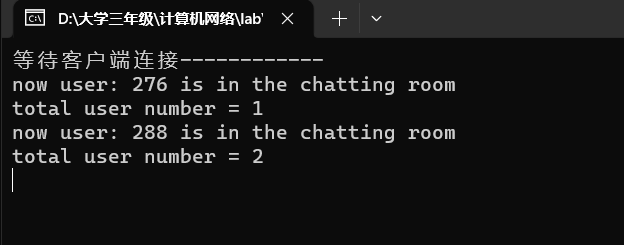
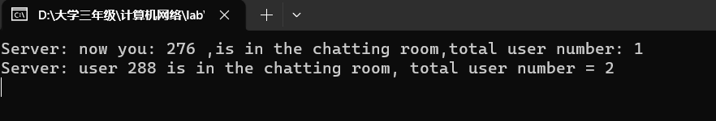
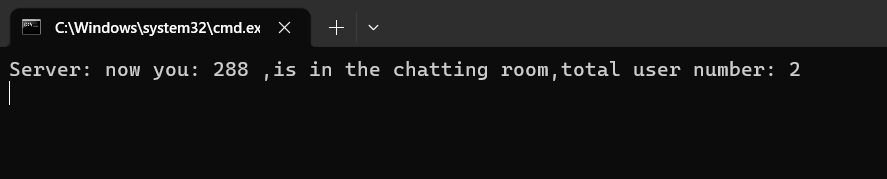
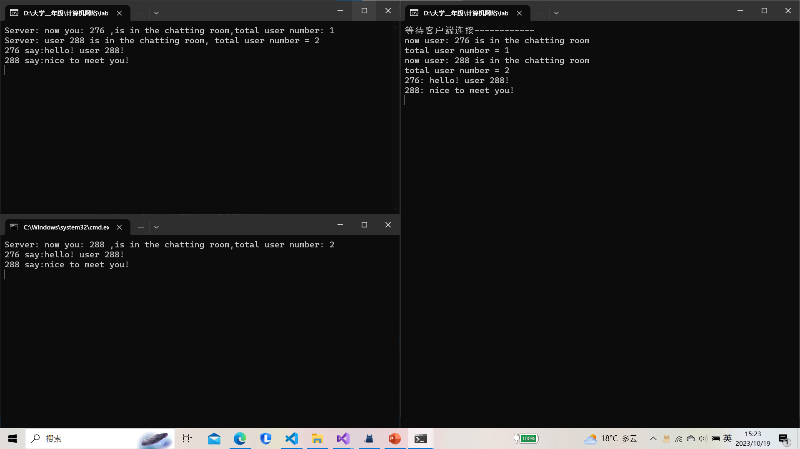
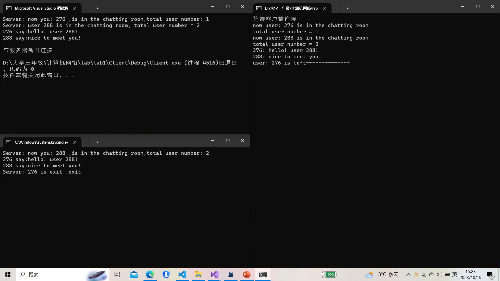

# 实验报告
学号：2114036		姓名：曹骜天
 1. 采用协议：TCP/IP协议
 2. 实现功能：多人聊天室

## 协议设计以及实现
采用TCP协议，实现多人聊天室，采用多线程实现，其中,Server.cpp为多人聊天室的服务器端实现、Client.cpp为多人聊天室的客户端实现。

### Server.cpp
首先，我们定义了最大的缓冲区大小为1024个字符，定义端口号为8000。
在主函数中，我们首先定义了一个套接字，然后定义了一个sockaddr_in类型的结构体，用于存储服务器的地址信息，然后调用bind函数将套接字与地址绑定，然后调用listen函数将套接字设置为监听状态，最后调用accept函数接受客户端的连接请求，返回一个新的套接字，用于与客户端进行通信。每当有一个客户端连接到服务器，服务器就会创建一个新的线程，用于与客户端进行通信。创建线程适用Windows平台下的CreateThread函数，其中线程函数为ThreadFun，参数为刚刚新创建的套接字。结束通信以后关闭套接字，结束主函数。以下为这个过程中调用到的函数：
```cpp
    WSAStartup();//初始化套接字库
    socket(AF_INET,SOCK_STREAM,IPPROTO_TCP);//创建套接字
    //在其中，采用IPV4、流式套接字、TCP协议
    bind();//将套接字与地址绑定
    listen();//将套接字设置为监听状态
    accept();//接受客户端的连接请求
    CreateThread();//创建线程
    closesocket();//关闭套接字
    WSACleanup();//终止套接字库的使用
```
接下来还有一个重要的函数，即ThreadFun函数，用于与客户端进行通信。在其中，对于发送信息，每当和一个客户端建立连接时通过缓冲区buf向其发送建立连接成功的消息。对于接收信息，我们定义了一个缓冲区recvbuf，用于存储客户端发送过来的信息，然后调用recv函数接收客户端发送过来的信息，再根据发送来的消息的类别，调用send函数将信息广播给其它客户端以实现多人聊天。当客户端发送的信息为“exit”时，表示客户端要退出聊天室，此时关闭套接字，结束线程。以下为这个过程：
```cpp
DWORD WINAPI ThreadFun(LPVOID threadPara)
DWORD WINAPI ThreadFun(LPVOID threadPara)
{
	//将LPVOID强制类型转换为SOCKET
	SOCKET client = (SOCKET)threadPara;

	cout << "now user: " << client << " is in the chatting room" <<endl<<"total user number = "<<(currentSize-countLeft)<< endl;

	//将信息写入buf中并发送
	char buf[BUFSIZE] = { 0 };
	sprintf_s(buf, "Server: now you: %d ,is in the chatting room,total user number: %d", client,currentSize-countLeft);
	send(client, buf, BUFSIZE, 0);
	for (int i = 0; i < currentSize; i++)
	{
		char broadcastBuf[BUFSIZE] = { 0 };
		if (c[i] != client)
		{
			sprintf_s(broadcastBuf, "Server: user %d is in the chatting room, total user number = %d", client, (currentSize - countLeft));
			send(c[i], broadcastBuf, BUFSIZE, 0);
		}
	}
	//接收客户端数据
	int ret = 0;//接收到的字节数
	do {
		char recvbuf[BUFSIZE] = { 0 };
		ret = recv(client, recvbuf, BUFSIZE, 0);
		if (strcmp(recvbuf, "exit") != 0)
		{
			for (int i = 0; i < currentSize; i++)
			{
				char broadcastBuf[BUFSIZE] = { 0 };
				sprintf_s(broadcastBuf, "%d say:", client);
				strcat_s(broadcastBuf, recvbuf);
				send(c[i], broadcastBuf, BUFSIZE, 0);
			}
			cout << client << ": " << recvbuf << endl;
		}
		else {
			cout <<"user: " << client << " is left--------------" << endl;
			for (int i = 0; i < currentSize; i++)
			{
				char broadcastBuf[BUFSIZE] = { 0 };
				sprintf_s(broadcastBuf, "Server: %d is exit !", client);
				strcat_s(broadcastBuf, recvbuf);
				send(c[i], broadcastBuf, BUFSIZE, 0);
			}
			countLeft++;
			closesocket(client);
			break;
		}
	} while (ret != SOCKET_ERROR && ret != 0);
	closesocket(client);
	return 0;
}
```

### Client.cpp
在客户端，我们定义了一个线程函数来负责连接过后从服务器端接收消息。主函数的主体部分为与服务器端建立连接，然后创建一个线程recvThread，用于接收服务器端发送过来的消息。主函数中还有一个循环，用于接收用户输入的消息，然后缓存在缓冲区buf中，然后发送给服务器端。当用户输入的消息为“exit”时，表示用户要退出聊天室，此时关闭套接字，结束线程。以下为这个过程：
```cpp
#define BUFSIZE 1024
#define PORT 8000
//接收服务器消息
DWORD WINAPI recvThread(LPVOID threadPara)
{
	SOCKET s = (SOCKET)threadPara;
	//循环接收服务器消息
	int ret = 0;
	do {
		char recvbuf[BUFSIZE] = { 0 };
		ret = recv(s, recvbuf, BUFSIZE, 0);
		cout << recvbuf << endl;
	} while (ret != SOCKET_ERROR && ret != 0);
	cout << "与服务器断开连接" << endl;
	return 0;
}

int main()
{
	WSADATA wsadata;
	if (WSAStartup(MAKEWORD(2, 2), &wsadata) != 0)
	{
		cout << "WSAStartup error: " << WSAGetLastError() << endl;
		return 0;
	}
	SOCKET s = socket(AF_INET, SOCK_STREAM, IPPROTO_TCP);
	if (s == INVALID_SOCKET)
	{
		cout << "socket error: " << WSAGetLastError() << endl;
		return 0;
	}

	//连接服务器的ip和端口号
	sockaddr_in addr;
	addr.sin_family = AF_INET;
	addr.sin_port = htons(PORT);
	inet_pton(AF_INET, "127.0.0.1", &addr.sin_addr.s_addr);//绑定本机地址
	if (connect(s, (SOCKADDR*)&addr, sizeof(sockaddr_in)) == SOCKET_ERROR)
	{
		cout << "Connect Error: " << WSAGetLastError() << endl;
		return 0;
	}
	//创建新线程接收服务器信息
	HANDLE hThread = CreateThread(NULL, 0, recvThread, (LPVOID)s, 0, NULL);
	if (hThread == NULL)
	{
		cout << "create recvThread error: " << GetLastError() << endl;
	}
	CloseHandle(hThread);
	//给服务器发消息
	int ret = 0;
	int flag = 1;//用于退出
	char buf[BUFSIZE] = { 0 };
	do {
		//读取一行
		cin.getline(buf, BUFSIZE);
		std::cout << "\033[A\033[K";  // 上移一行并清除当前行
		if (strcmp(buf, "exit")==0)
			flag = 0;
		ret = send(s, buf, BUFSIZE, 0);
		if (flag == 0)
			break;
	} while (ret != SOCKET_ERROR && ret != 0);
	closesocket(s);
	
	if (WSACleanup() != 0)
	{
		cout << "WSACleanup Error: " << WSAGetLastError() << endl;
	}
	return 0;
}
```

### 程序展示
首先打开一个服务器端，再打开多个客户端，这里以两个客户端为例：

服务器端：

客户端1进入：

客户端2进入：

发送消息聊天：

退出：

数据丢失：在buf范围内无数据丢失