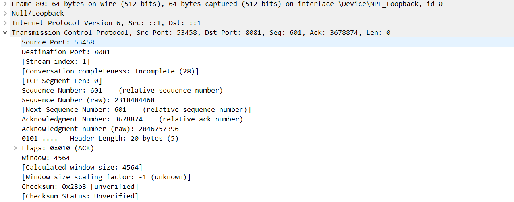
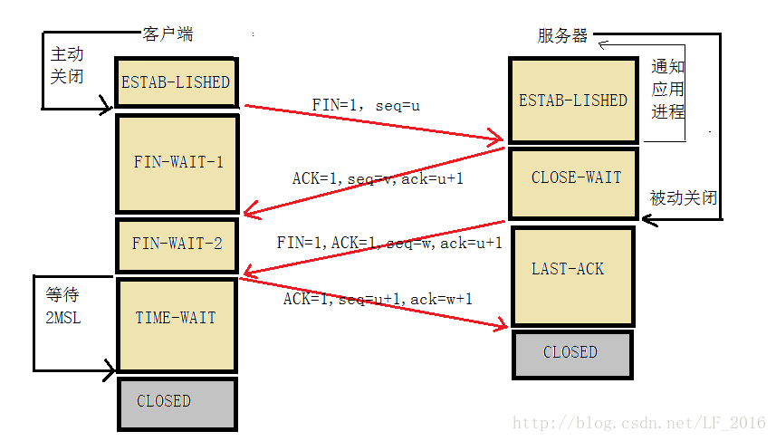

# WEB服务器的搭建与页面的编写

使用python，在对应项目文件夹下打开命令行，在终端中输入命令：
```terminal
python -m http.server 8081
```
表示在8081端口上启动一个http服务器，此时若创建成功，终端中会显示
```terminal
Serving HTTP on :: port 8081 (http://[::]:8081/) ...
```
此时在浏览器中输入`localhost:8081`即可访问该项目文件夹下的内容。

接下来需要在项目文件夹下编写html文件，命名为test，然后在浏览器中输入`localhost:8081/test.html`即可访问。
```html
<html>
<head>
    <meta charset="utf-8">
    <title>Test</title>
</head>
<body>
    <h1>我是牢大</h1>
    <p>我将在复活节归来</p>
    <p>牢大 logo:</p>
    
    <audio controls>
        <source src="kobe.mp3" type="audio/mpeg">
    </audio>

    <p>作者： 计算机科学与技术  2114036  曹骜天</p>
</body>
</html>
```
此html的文件结构如下：由<html>和</html>标签包裹，<head>和</head>标签中包含了该html文件的元信息，<body>和</body>标签中包含了该html文件的主要内容，其中包含了一个标题，两个段落，一张图片，一段音频，以及一段文字。

在网页中打开该html文件，显示如下：


# 采用wireshark抓包分析http协议

## 三次握手的过程
我们假定服务器端的地址为8081（如上所述），可以看到在有http请求之前发生了三次握手：


在第一次握手的过程中，捕获到的信息如下：


本次握手是由客户端向服务器端发送建立连接的请求。其中，Sequence Number = 0说明用户选择的初始化序列号(client_isn)为0，Window Size = 65535说明用户选择的窗口大小为65535，TCP Flags中的SYN标志位为1，其余标志位均为0。我们将此报文段称为TCP SYN报文段。

第二次握手捕获的信息如下：


服务器收到客户端发过来报文，由SYN=1知道客户端要求建立连接。在此时将SYN和ACK的值置为1，表示同意建立连接。同时将acknowledgement number设置为client_isn+1，表示服务器端期望收到的下一个报文段的序列号。同时将sequence number置为0，表示(server_isn)。我们将此报文段称为TCP SYN+ACK报文段。

第三次握手的捕获信息如下：


客户端收到 SYNACK的报文段信息后，将SYN置为0，ACK置为1，表示收到了服务器端的确认信息。同时将acknowledgement number设置为server_isn+1，表示客户端期望收到的下一个报文段的序列号。同时将sequence number置为client_isn+1，可进行发送数据。
接下来，可对服务器端发送http请求。

## http请求的过程
对于http的报文格式，我们抓取了请求报文和响应报文两种，分别如下：
请求报文：

可以看到，get为请求的方式，后接请求的资源以及http版本号，后面为请求头，包含了请求的主机，连接方式，用户代理，以及其他信息。可以看到：host主机名为8081，连接方式为keep-alive，用户代理为Mozilla/5.0，表示使用的是Mozilla浏览器。

响应报文：
响应报文的第一行为状态行，200表示请求成功，后面为响应头，包含了服务器的信息，以及其他信息。可以看到服务器为SimpleHTTP/0.6 Python/3.10.10，表示使用的是python的http服务器。http版本为http1.0版本，注意，利用python http.server创建的服务器默认为http1.1版本。**但在实验中发现响应为http1.0版本，因此还是遵循http1.0的特性，即每一次请求完毕后立刻断开连接**

## 四次挥手的过程
在完成了http请求之后，客户端和服务器端需要断开连接，此时发生了四次挥手（中间的TCP window update为窗口的更新变化，可以忽略）：


第一次挥手时，由服务器端发送断开连接的请求，其中FIN=1表示想要断开连接


第二次挥手表示客户端收到服务器端的确认，由于不传输数据，Sequence Number为上一次客户端的值，Ack则是服务端的Seq+1，表示收到了服务器的数据。标志位ACK为1。


接下来， 随后客户端又发送标志位FIN,ACK，Seq=上一次的客户端Seq，不加1因为没有传输有效的数据，Ack=上一次客户端的确认码，不加1，原因是也没有有效数据，代表客户端也可以关闭此连接了，不传输数据了。


最后，服务器端收到客户端的FIN,ACK。Ack为发送端的Seq+1,表示收到了通知消息，Seq不变，表示服务器端也可以关闭此连接了，不传输数据了。


## 一些问题解答
1. 为什么在最后发送完ACK后需要等待一会儿才关闭？
   
这最主要是因为两个理由：

   1. 为了保证客户端发送的最后一个ACK报文段能够到达服务器。因为这个ACK有可能丢失，从而导致处在LAST-ACK状态的服务器收不到对FIN-ACK的确认报文。服务器会超时重传这个FIN-ACK，接着客户端再重传一次确认，重新启动时间等待计时器。最后客户端和服务器都能正常的关闭。假设客户端不等待2MSL，而是在发送完ACK之后直接释放关闭，一但这个ACK丢失的话，服务器就无法正常的进入关闭连接状态。

   2. 他还可以防止已失效的报文段。客户端在发送最后一个ACK之后，再经过经过2MSL，就可以使本链接持续时间内所产生的所有报文段都从网络中消失。从保证在关闭连接后不会有还在网络中滞留的报文段去骚扰服务器。

注意：在服务器发送了FIN-ACK之后，会立即启动超时重传计时器。客户端在发送最后一个ACK之后会立即启动时间等待计时器。

2. 在采用此方式时，会出现http请求和相应版本不一致的情况，如前所示，请求版本为http1.1，响应版本却为http1.0。发现在windows10系统下才存在此bug,将操作系统升级到windows11则解决问题。