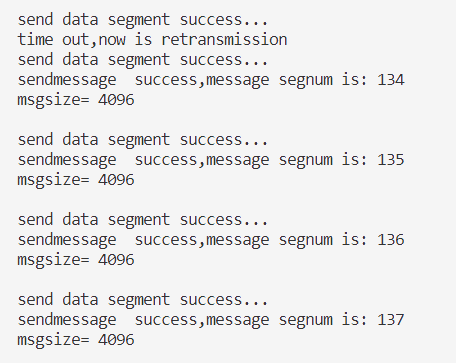

# 实验报告
`2114036 曹骜天`

## 协议设计
### 数据报格式： 
   
在我的协议中，`client.h`定义了`UDP_header`的数据报头部，它是一个有着如下结构的结构体：
```c++
    struct UDP_HEADER
{
    //16位源端口号与目的端口号
    uint16_t src_port;
    uint16_t dst_port;
    //16位UDP报文长度
    uint16_t length;
    //16位UDP检验和
    uint16_t checksum;
    //序列号
    uint8_t seq;
    //用于握手与挥手的标志位
    uint8_t flag;
};
```
此结构体包含了以下内容：
1. 16位的源端口号与目的端口号，用于标识发送方与接收方的端口号。
2. 16位的UDP报文长度，用于标识UDP报文的长度。
3. 16位的UDP检验和，用于检验UDP报文的正确性。
4. 8位的序列号，用于标识UDP报文的序列号。
5. 8位的标志位，用于标识UDP报文的类型，包括握手、挥手、数据报文标志位等。
### 连接的建立与结束：

我们采用类似TCP的三次握手以及自定义的两次挥手来完成这个过程：为了完成这些过程，我们在`UDP_header`中的`flag`字段进行了定义：
```c++
/*
uint8_t flag：
|0|0|0|0|0|FIN|ACK|SYN|
*/
const uint8_t SYN=0x01; 
const uint8_t ACK=0x02;
const uint8_t SYN_ACK=0x03;
const uint8_t FIN=0x04;
```
类似TCP，定义了`SYN、ACK、SYN_ACK、FIN`四种标志位，用于标识握手、挥手的过程。
1. 三次握手的过程：三次握手的过程和TCP连接建立类似，值得说明的是，在连接建立时发送的数据报都为**仅包含头部的数据报**，因为在连接建立时我们不需要发送数据，仅使用头部的标志位来进行确认。
   1. 第一次握手时，客户端发送一个`SYN`标志位的数据报给服务器，表示请求建立连接。
   2. 第二次握手时，服务器收到客户端的请求后，发送一个`SYN_ACK`标志位的数据报给客户端，表示同意建立连接。
   3. 第三次握手时，客户端收到服务器的同意后，发送一个`ACK`标志位的数据报给服务器，表示连接建立成功。
   4. 注意，在客户端发送完第三次握手的信息后，为保证服务器收到信息，客户端会等待一段时间，如果服务器重新发送了`SYN_ACK`标志位的数据报，则表示服务器没有收到`ACK`标志位的数据报，客户端会重新发送`ACK`标志位的数据报，然后重新开始计时。
2. 与TCP不同的是，我们的连接结束过程只需要两次挥手即可完成，这是我们简化的过程：
   1. 第一次挥手时，客户端发送一个`FIN`标志位的数据报给服务器，表示请求断开连接。
   2. 第二次挥手时，服务器收到客户端的请求后，发送一个`FIN`标志位的数据报给客户端，表示同意断开连接。
   
**注：这部分的核心代码会在后续一同展示**

### 差错检验
在差错检验方式，使用校验和模式，即在发送方计算校验和，然后将校验和放在UDP头部的`checksum`字段中，接收方在接收到数据报后，重新计算校验和，如果校验和为0，则说明数据报没有出错，否则说明数据报出错，需要重新发送。此部分我们在如下函数定义：
```c++
uint16_t UDP_checksum(uint16_t* buffer,int size)
{
    //以16位为单位加法，先计算出总共需要加的次数
    int count = (size+1)/2;
    uint16_t* buf=(uint16_t*)malloc(size+1);
    memset(buf,0,size+1);
    memcpy(buf,buffer,size);
    //32位用来判断是否进位
    uint32_t sum=0;
    while (count--)
    {
        sum+=*buf++;
        //判断是否需要进位
        if(sum&0xffff0000)
        {
            sum&=0xffff;
            sum++;
        }
    }
    //返回的为16位
    return ~(sum&0xffff);
}
```
在此函数中，我们传入缓冲区与需要计算校验和的大小，然后将缓冲区的内容复制到一个新的缓冲区中，这么做的目的是由于在计算校验和时，我们以16位为单位进行加法运算，如果缓冲区的大小为奇数，则最后一个字节无法进行加法运算，若直接扩充该缓冲区，则有可能使用到污染的数据(后续缓冲区不一定是0，虽然在本次实验中，每次传输完成都将缓冲区清零了)

在本函数中的执行过程如下：
1. 首先我们将传入的字节数(8位)除以2并向上取整(变为16位)，变为要计算校验和的次数。
2. 然后分配一块比原缓冲区大小多1字节的新缓冲区，便于在后续补零的计算。
3. 接着将该缓冲区初始化为0，然后将原缓冲区的内容复制到新缓冲区中。
4. 接着需要用一个32位的变量来存储计算过程中的结果，然后开始计算，每次计算16位，如果计算结果超过16位，则将高16位移除，低16位加1。
5. 最后计算出的结果取反，返回即可。

### 接收确认
在Client发送数据给Server后，Server会发送一个只包含头部的数据报给Client，并且该数据报的`flag`字段为`ACK`，且`seq`序号为发送方的`seqnum`，表示接收到了Client发送的数据报。在此过程中，发送方会进行等待，直到收到接收方的确认信息且没有错误，才会进行下一个报文段的发送。这部分的代码由于也包含了超时重传机制，将会在后续展示。

### 重传机制
在重传机制方面，分为两种的重传方式：数据报接收校验和错误的重传、超时重传。

为了方便生成报文段头部，我们定义了两个函数，分别进行只包含报文段头部的`UDP_header`的初始化与包含了数据的`UDP_header`的初始化，这个函数的实现较为简单，区别在于直接计算了校验和和先把校验和字段设为0，在后续拼接上数据后进行手动计算：
```c++
void init_header(UDP_HEADER& header,uint16_t src_port,uint16_t dst_port,uint16_t length,uint16_t checksum,uint8_t seq,uint8_t flag)
{
    header.src_port=src_port;
    header.dst_port=dst_port;
    header.length=length;
    header.checksum=checksum;
    header.seq=seq;
    header.flag=flag;
    header.checksum=UDP_checksum((uint16_t*)&header,sizeof(header));
}

void init_msg_header(UDP_HEADER& header,uint16_t src_port,uint16_t dst_port,uint16_t length,uint8_t seq,uint8_t flag)
{
    header.src_port=src_port;
    header.dst_port=dst_port;
    header.length=length;
    header.checksum=0;
    header.seq=seq;
    header.flag=flag;
}
```
#### 超时重传的实现
为实现超时重传，我们调用了Windows库函数`setsockopt`，该函数可以设置套接字的属性，我们知道，在默认情况下，`recvfrom`函数是阻塞的，也就是说，在接收到消息之前，程序会一直处于等待状态，而设置套接字的属性可以手动设置等待的时间，在超过该时间后，`recvfrom`函数会返回一个错误，我们可以通过这个错误是否为`WSAETIMEDOUT`来判断是否超时，从而进行超时重传。函数实现如下：
```c++
    //设置超时时间
    DWORD timeout=500;
    //设置超时选项
    if(setsockopt(clientSocket,SOL_SOCKET,SO_RCVTIMEO,(const char*)&timeout,sizeof(timeout))==SOCKET_ERROR)
    {
        cerr<<"setsockopt error"<<endl;
        return -1;
    }
```

#### 三次握手时的重传以及完整代码实现
##### 服务器端
分析三次握手过程，服务器端在接收到第一次建立连接请求之前会一直进行等待，接收到请求连接过后要经历如下过程，后续的步骤也是类似：
1. 首先进行校验和的检验，如果校验和错误，则回到之前的等待连接状态。
2. 判断接收的头部的标志位是否为`SYN`,若不为则退出程序并报错，因为这不是一个合法的建立连接的请求。
3. 若接收正确，则准备发送一个`SYN_ACK`标志位的数据报给客户端，表示同意建立连接。若在此过程中发送错误，则重新发送
4. 接下来将会等待接收客户端发送的`ACK`标志位的数据报，但在此之前，需要进行超时重传时间的设定，若超时，则重新发送`SYN_ACK`标志位的数据报，提示客户端重新发送`SYN`标志位的数据报。
5. 检验接收到的数据报的校验和是否正确，若不正确，则重新发送`SYN_ACK`标志位的数据报，提示客户端重新发送`SYN`标志位的数据报。
   
至此实现了完整的服务器端三次握手过程，服务器端代码如下：
```c++
int UDP_Server_connect(SOCKET& serverSocket,SOCKADDR_IN& clientAddr,int& clientAddrLen)
{
    cout<<"Server: "<<"begin to connect..."<<endl;
    char* recvbuffer=(char*)malloc(MAXBUFSIZE);
    char* sendbuffer=(char*)malloc(MAXBUFSIZE);
    memset(recvbuffer,0,MAXBUFSIZE);
    memset(sendbuffer,0,MAXBUFSIZE);
    UDP_HEADER header;
    DWORD timeout=500;
    //第一次握手，接收SYN报文
    ssize_t recvSize;
    //等待接收SYN报文
connect_first_step:
    //TODO:服务器等待建立连接,阻塞就行
    recvSize=recvfrom(serverSocket,recvbuffer,MAXBUFSIZE,0,(sockaddr*)&clientAddr,&clientAddrLen);
    if(recvSize==SOCKET_ERROR)
    {
        cerr<<"receive SYN segment failed,please resend...:"<<WSAGetLastError()<<endl;
        goto connect_first_step;
    }
    memcpy(&header,recvbuffer,sizeof(header));
    //检验和,若校验和不为0，则出错，接收重传信息
    if (UDP_checksum((uint16_t*)recvbuffer,recvSize)!=0)
    {
        cerr<<"SYN checksum error ,now is retransmission "<<endl;
        goto connect_first_step;
    }
    //判断是否为SYN报文
    if(header.flag!=SYN)
    {
        cerr<<"SYN flag error!"<<endl;
        return -1;
    }
    cout<<"Receive SYN Segment..."<<endl;
    //TODO：设置超时选项
    if(setsockopt(serverSocket,SOL_SOCKET,SO_RCVTIMEO,(const char*)&timeout,sizeof(timeout))==SOCKET_ERROR)
    {
        cerr<<"setsockopt error"<<endl;
        return -1;
    }
    //第二次握手,发送SYN_ACK报文
    init_header(header,SERVER_PORT,CLIENT_PORT,sizeof(header),0,0,SYN_ACK);
    memcpy(sendbuffer,&header,sizeof(header));
connect_second_step:
    if(sendto(serverSocket,sendbuffer,sizeof(header),0,(sockaddr*)&clientAddr,clientAddrLen)<=0)
    {
        cerr<<"send SYN_ACK segment failed,now going to resend...:"<<WSAGetLastError()<<endl;
        goto connect_second_step;
    }
    cout<<"send SYN_ACK Segment..."<<endl;
    //第三次握手，接收ACK报文
    memset(recvbuffer,0,MAXBUFSIZE);
    if((recvSize=recvfrom(serverSocket,recvbuffer,MAXBUFSIZE,0,(sockaddr*)&clientAddr,&clientAddrLen))==SOCKET_ERROR)
    {
        //todo:如果超时，重传SYN_ACK报文
        if(WSAGetLastError()==WSAETIMEDOUT)
        {
            cerr<<"receive ACK segment timeout, now is retransmission"<<endl;
            goto connect_second_step;
        }

    }
    memcpy(&header,recvbuffer,sizeof(header));
    //检验和，若不正确则重传SYN_ACK报文,提醒客户端重传ACK报文
    if (UDP_checksum((uint16_t*)recvbuffer,recvSize)!=0)
    {
        cerr<<"ACK checksum error, now is retransmission"<<endl;
        goto connect_second_step;
    }
    //判断是否为ACK报文
    if(header.flag!=ACK)
    {
        cerr<<"ACK flag error, now is retransmission"<<endl;
        return -1;
    }
    cout<<"Receive ACK segment..."<<endl;
    cout<<"UDP connect success"<<endl;
    free(sendbuffer);
    free(recvbuffer);
    return 0;
}
```

##### 客户端
1. 同样的，首先设置超时重传时间。
2. 第一次握手，发送`SYN`标志位的数据报给服务器，表示请求建立连接。
3. 第二次握手，等待接收服务器发送的`SYN_ACK`标志位的数据报，若超时，则重新发送`SYN`标志位的数据报，提示服务器重新发送`SYN_ACK`标志位的数据报。若校验和错误，则也重新发送`SYN`标志位的数据报，提示服务器重新发送`SYN_ACK`标志位的数据报。
4. 第三次握手，发送`ACK`标志位的数据报给服务器，在发送完成后，应该等待一段时间，查看服务器是否有重传的`SYN_ACK`标志位的数据报，若有，则说明服务器没有收到`ACK`标志位的数据报，此时客户端应该重新发送`ACK`标志位的数据报，然后重新开始计时。

**注意**：在此部分中的等待时间应该比超时重传的时间长，因为服务器在进行等待`ACK`报文段的时候，客户端也在进行等待，若两者的等待时间相同，则当服务器想要重传`SYN_ACK`报文段时，客户端已经停止了等待，此时服务器重传的`SYN_ACK`报文段会被客户端丢弃，从而导致连接建立失败。

客户端建立连接代码如下：
```c++
int UDP_Client_connect(SOCKET& clientSocket,SOCKADDR_IN& serverAddr,int& serverAddrLen)
{
    cout<<"Client: "<<"begin to connect..."<<endl;
    char* recvbuffer=(char*)malloc(MAXBUFSIZE);
    char* sendbuffer=(char*)malloc(MAXBUFSIZE);
    UDP_HEADER header;
    //设置超时时间
    DWORD timeout=500;
    //设置超时选项
    if(setsockopt(clientSocket,SOL_SOCKET,SO_RCVTIMEO,(const char*)&timeout,sizeof(timeout))==SOCKET_ERROR)
    {
        cerr<<"setsockopt error"<<endl;
        return -1;
    }

    //第一次握手，发送SYN报文
    ssize_t recvSize;
connect_first_step:
    memset(sendbuffer,0,MAXBUFSIZE);
    memset(recvbuffer,0,MAXBUFSIZE);
    init_header(header,CLIENT_PORT,SERVER_PORT,sizeof(header),0,0,SYN);
    memcpy(sendbuffer,&header,sizeof(header));
    if(sendto(clientSocket,sendbuffer,sizeof(header),0,(sockaddr*)&serverAddr,serverAddrLen)<=0)
    {
        cerr<<"send SYN segment error"<<endl;
        return -1;
    }
    cout<<"send SYN segment success"<<endl;
    //第二次握手，接收SYN_ACK报文
    //开始计时：
    if((recvSize=recvfrom(clientSocket,recvbuffer,MAXBUFSIZE,0,(sockaddr*)&serverAddr,&serverAddrLen))==SOCKET_ERROR)
    {
        //TODO:超时则自身重传SYN报文
        if(WSAGetLastError()==WSAETIMEDOUT)
        {
            cerr<<"time out,now is retransmission"<<endl;
            goto connect_first_step;
        }
    }
    memcpy(&header,recvbuffer,sizeof(header));
    if(UDP_checksum((uint16_t*)recvbuffer,recvSize)!=0)
    {
        cerr<<"SYN_ACK checksum error, now is retransmission"<<endl;
        goto connect_first_step;
    }
    if(header.flag!=SYN_ACK)
    {
        cerr<<"SYN_ACK flag error!"<<endl;
        return -1;
    }
    cout<<"Receive SYN_ACK segment..."<<endl;
    //第三次握手，发送ACK报文
connect_second_step:
    memset(sendbuffer,0,MAXBUFSIZE);
    init_header(header,CLIENT_PORT,SERVER_PORT,sizeof(header),0,0,ACK);
    memcpy(sendbuffer,&header,sizeof(header));
    if(sendto(clientSocket,sendbuffer,sizeof(header),0,(sockaddr*)&serverAddr,serverAddrLen)<=0)
    {
        cerr<<"send ACK segment failed,now going to resend...:"<<WSAGetLastError()<<endl;
        goto connect_second_step;
    }
    cout<<"send ACK segment success"<<endl;
    //TODO:进入等待接收状态，在一定时间内看对方是否有重传的报文(这里假定这个报文一定代表着重传信号)，若有则重传ACK报文,否则连接成功
    //这一段超时时间要设置的长一点
    timeout=1000;
    //设置超时选项
    if(setsockopt(clientSocket,SOL_SOCKET,SO_RCVTIMEO,(const char*)&timeout,sizeof(timeout))==SOCKET_ERROR)
    {
        cerr<<"setsockopt error"<<endl;
        return -1;
    }
    if((recvSize=recvfrom(clientSocket,recvbuffer,MAXBUFSIZE,0,(sockaddr*)&serverAddr,&serverAddrLen))!=SOCKET_ERROR)
    {
        cerr<<"recv SYN_ACK segment again,now going to resend..."<<endl;
        goto connect_second_step;
    }
    
    free(recvbuffer);
    free(sendbuffer);
    cout<<"UDP Client connect success"<<endl<<endl;
    return 0;
}
```

#### 两次挥手时的重传以及完整代码实现

##### 服务器端
服务器端自建立连接之后，就一直处于接收消息并发送ACK报文的阶段，因此只需判断客户端是否为发送了`FIN`标志位的数据报，若是，则发送一个`FIN`标志位的数据报给客户端，然后开始等待一段时间，查看客户端是否有的`FIN`标志位的数据报，若没有，则关闭服务器，若有，则重新发送`FIN`标志位的数据报给客户端，然后重新开始计时，同理此等待时间应该比超时重传的时间长，代码如下：
```c++
//这是关闭连接的分支，前面还有普通接收消息的分支
else if(header.flag==FIN)
{
    cout<<"receive FIN segment success, begin to disconnect..."<<endl;
disconnect:
    //得到消息关闭连接，同时发给客户端FIN报文
    init_header(header,SERVER_PORT,CLIENT_PORT,sizeof(header),0,0,FIN);
    memcpy(sendbuffer,&header,sizeof(header));
    if(sendto(serverSocket,sendbuffer,sizeof(header),0,(sockaddr*)&clientAddr,clientAddrLen)<=0)
    {
        cerr<<"send FIN segment failed,now going to resend...:"<<WSAGetLastError()<<endl;
        continue;
    }
    cout<<"send FIN segment success!"<<endl;
    //TODO:等待一段时间，对方没有发来消息
    timeout=1000;
    if(setsockopt(serverSocket,SOL_SOCKET,SO_RCVTIMEO,(const char*)&timeout,sizeof(timeout))==SOCKET_ERROR)
    {
        cerr<<"setsockopt error"<<endl;
        return -1;
    }
    if((recvSize=recvfrom(serverSocket,recvbuffer,MAXBUFSIZE,0,(sockaddr*)&clientAddr,&clientAddrLen))!=SOCKET_ERROR)
    {
        //有收到信息，默认为FIN，进行重传
        cerr<<"receive FIN segment again, now is retransmission"<<endl;
        goto disconnect;
    }
    //关闭连接
    cout<<"UDP server disconnect success"<<endl;
    cout<<"UDP server is closed"<<endl;
    break;
}

```

##### 客户端
客户端只需要发送`FIN`报文，然后进行超时等待，然后根据是否超时以及校验和是否错误决定是否重传即可，收到服务器的`FIN`报文后，客户端关闭连接，代码如下：
```c++
disconnect_first_step:
    memset(recvbuffer,0,MAXBUFSIZE);
    memset(sendbuffer,0,MAXBUFSIZE);
    init_header(header,CLIENT_PORT,SERVER_PORT,sizeof(header),0,0,FIN);
    memcpy(sendbuffer,&header,sizeof(header));
    if(sendto(clientSocket,sendbuffer,sizeof(header),0,(sockaddr*)&serverAddr,serverAddrLen)<=0)
    {
        cerr<<"send FIN segment failed,now going to resend...:"<<WSAGetLastError()<<endl;
        goto disconnect_first_step;
    }
    cout<<"send FIN segment success"<<endl;
    //接收FIN报文
    ssize_t recvSize;
    DWORD timeout=500;
    //设置超时选项
    if(setsockopt(clientSocket,SOL_SOCKET,SO_RCVTIMEO,(const char*)&timeout,sizeof(timeout))==SOCKET_ERROR)
    {
        cerr<<"setsockopt error"<<endl;
        return -1;
    }
    if((recvSize=recvfrom(clientSocket,recvbuffer,MAXBUFSIZE,0,(sockaddr*)&serverAddr,&serverAddrLen))==SOCKET_ERROR)
    {
        //TODO；等待一段时间没有收到重新发送FIN报文
        if(WSAGetLastError()==WSAETIMEDOUT)
        {
            cerr<<"time out,now is retransmission"<<endl;
            goto disconnect_first_step;
        }
    }
    memcpy(&header,recvbuffer,sizeof(header));
    //检验和，若不正确则重传FIN报文
    if(UDP_checksum((uint16_t*)recvbuffer,recvSize)!=0)
    {
        cerr<<"checksum error, now is retransmission"<<endl;
        goto disconnect_first_step;
    }
    //判断是否为FIN报文
    if(header.flag!=FIN)
    {
        cerr<<"FIN flag error!"<<endl;
        return -1;
    }
    cout<<"Receive FIN segment success"<<endl;
    cout<<"UDP Client disconnect success"<<endl;
```

### 数据传输
#### 客户端
数据传输的重传大致大致和前面描述的一致，但有如下特性：由停等协议，客户端需要在收到一个`ACK`报文段以及相应的确认序号后才能进行下一个数据报的传输。因此客户端只需要对`ACK`进行一次超时等待，若超时，则重传数据报，确认序列号不一致也需要重传数据报，Client代码如下：
```c++
int UDP_Sendmsg(SOCKET& clientSocket,SOCKADDR_IN& serverAddr,int& serverAddrLen,char* sendbuffer,char* recvbuffer,size_t sendSize)
{
    UDP_HEADER header;
    ssize_t recvSize;
    DWORD timeout=500;
    //发送数据报文,其中sendbuffer已经封装好,包含了UDP报文头部
send_first_step:
    if(sendto(clientSocket,sendbuffer,sendSize,0,(sockaddr*)&serverAddr,serverAddrLen)<=0)
    {
        cerr<<"send data segment failed,now going to resend...:"<<WSAGetLastError()<<endl;
        goto send_first_step;
    }
    cout<<"send data segment success..."<<endl;
    //接收ACK报文
    if(setsockopt(clientSocket,SOL_SOCKET,SO_RCVTIMEO,(const char*)&timeout,sizeof(timeout))==SOCKET_ERROR)
    {
        cerr<<"setsockopt error"<<endl;
        return -1;
    }
    if((recvSize=recvfrom(clientSocket,recvbuffer,MAXBUFSIZE,0,(sockaddr*)&serverAddr,&serverAddrLen))==SOCKET_ERROR)
    {
        //TODO:超时未收到重发数据报文
        if(WSAGetLastError()==WSAETIMEDOUT)
        {
            cerr<<"time out,now is retransmission"<<endl;
            goto send_first_step;
        }
    }
    memcpy(&header,recvbuffer,sizeof(header));
    //检验和，若不正确则重传数据报文
    if(UDP_checksum((uint16_t*)recvbuffer,recvSize)!=0)
    {
        cerr<<"recvmessage ACK checksum error, now is retransmission"<<endl;
        goto send_first_step;
    }
    //判断是否为ACK报文
    if(header.flag!=ACK)
    {
        cerr<<"ACK flag error!"<<endl;
        return -1;
    }
    //查看序列号是否和发送序列号一致
    if(header.seq!=seqnum)
    {
        cerr<<"seqnum error,now is retransmission"<<endl;
        goto send_first_step;
    }
    cout<<"sendmessage  success,message segnum is: "<<int(seqnum)<<endl<<"msgsize= "<<sendSize<<endl<<endl;
    return 0;
}
```

#### 服务器端
在服务器端中，由于需要确认是重传的数据还是新的数据，于是维护了一个`last_seqnum`变量，用来保存上一次收到的数据报序列号，若本次收到序列号与其相等，则说明是重传的消息，则不往文件里写入，否则将缓冲区内容写入新文件中。由于服务器端只负责接收消息以及传输`ACK`报文段，不需要设置超时重传。
```c++
//接收到普通消息
if(header.flag==ACK)
{
    cout<<"recieve msg success, msg seqnum= "<<int(header.seq)<<endl<<"msgsize= "<<recvSize<<endl;
    memcpy(msg,recvbuffer+sizeof(header),recvSize-sizeof(header));
    //TODO:将消息写入文件,比较seqnum和last_seqnum来确定是否是重传的消息
    if(recvSize-sizeof(header)>0  && header.seq!=last_seqnum)
    {
        file.write(msg,recvSize-sizeof(header));
        last_seqnum=header.seq;
    }
    if(header.seq==last_seqnum)
    {
        cout<<"receive repeat seqnum, now is retransmission ACK"<<endl;
    }
    //发送ACK报文给客户端,发送相同的序列号
    init_header(header,SERVER_PORT,CLIENT_PORT,sizeof(header),0,header.seq,ACK);
    memcpy(sendbuffer,&header,sizeof(header));
    if(sendto(serverSocket,sendbuffer,sizeof(header),0,(sockaddr*)&clientAddr,clientAddrLen)<=0)
    {
        cerr<<"send ACK segment failed,now going to resend...:"<<WSAGetLastError()<<endl;
        continue;
    }
    cout<<"send ACK segment success, seqnum= "<<int(header.seq)<<endl<<endl;
    memset(msg,0,MAXBUFSIZE-sizeof(header));
}
```

## 流量控制
使用停等机制，实现在前面已经描述清除。

## 程序运行分析
路由器设置如下：


握手建立连接过程：


运行结果如下，任意传输文件：

客户端：



服务器端：


传输完成并关闭结果：

客户端：


服务器端：


传输结果分析：

本次传输的文件为helloworld.txt,传输文件大小通过日志输出可以得到为1655808字节，查看源文件得到：


传输大小正确。

传输速率也显示正确，在日志输出中显示。

## 程序使用方法：
若要修改传输文件以及接收文件的路径，可在client.cpp与server.cpp中进行相应修改，分别在`ifstream`与`ofstream`关键字处。修改完成且保存后，在终端中输入make命令(要求设备安装GUNmake)，然后在终端中输入`./server`与`./client`即可运行程序。
