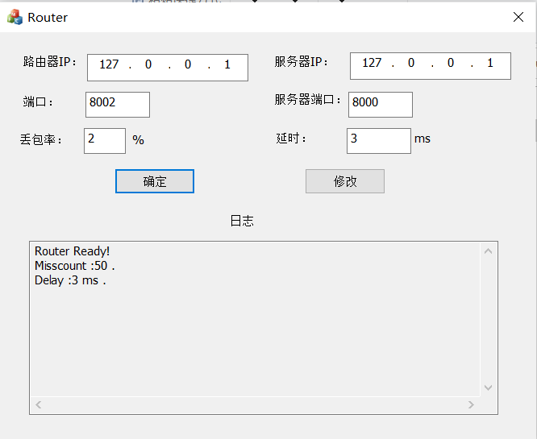
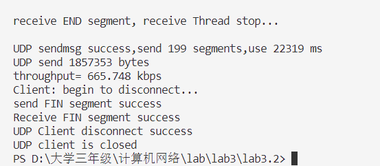
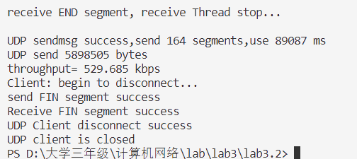
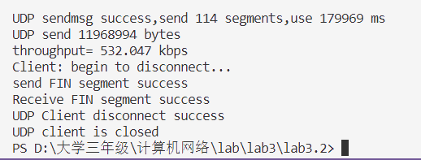
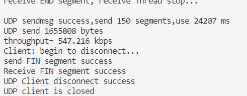
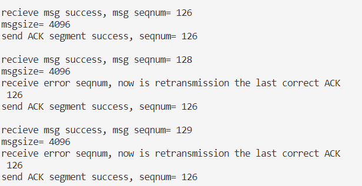
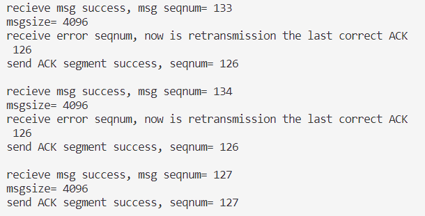
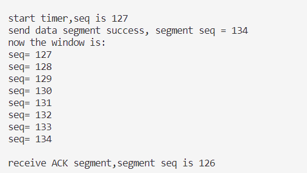
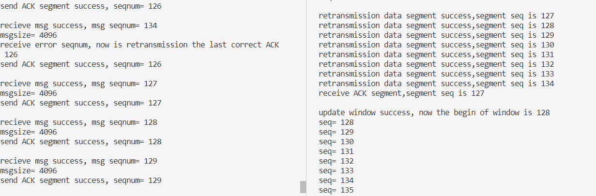

# lab3.2实验报告
2114036 曹骜天
## 协议设计
本次实验在实验3.1的基础上进行改进，完成了基于滑动窗口的流量控制机制，同时采用GBN的重传机制，因此接收窗口的大小为1，发送窗口的大小可自行设置。

确认采用累计确认的方式，即接收方只需要发送一个ack，表示已经接收到了序列号为ack的数据报之前的所有数据报。其中滑动窗、计时器等关键数据结构的设计在下面会详细介绍。

信息交互的过程：
1. 发送方首先查看滑动窗口是否已满，若未满，则从发送缓冲区中取出一个数据报，将其添加到滑动窗中，并将其发送出去。
2. 发送方为第一个未被确认的数据报(在本实验的实现过程中实际上是为滑动窗数据结构中的第一个数据报)开启计时器。
3. 接收方接收到数据报后，首先判断数据报是否连续，若连续，则将其写入文件中，然后发送发送来的数据报对应的ack，若不连续，则丢弃该数据报，发送最后一个连续的数据报(正确的数据报)对应的ack。校验和错误所进行的处理也是一样的。
4. 接收方接收到ack数据报后，会更新滑动窗口，若该ack对应的数据报在滑动窗口中，则将其以及之前的数据报从滑动窗口中删除（累计确认数据报），若不在，则什么也不做，只是检查之前设置的计时器是否超时。
5. 若计时器超时，则将滑动窗口中该计时器所对应的数据报以及之后的数据报全部重传，然后重新为最早未确认的数据报开启计时器。
6. 若计时器未超时，且接收到计时器对应的数据报，则对应更新滑动窗口，为新的第一个未确认的数据报开启计时器。


**notice**：由于三次握手和两次挥手的过程由于先前的协议设计，仍然采用的停止等待协议，在本次实验中，采用GBN协议为发送文件与接收文件的过程，并不是建立连接的过程。特此说明。

### 滑动窗数据结构的设计
在本次实验中，我们将滑动窗口用一个类来实现，通过往窗口里添加、删除发送缓冲区的数据来得到“滑动”的功能：当发送方向接收方发送数据时，会首先向滑动窗内提交相同的数据，接收方返回ack的确认(累计确认方式)时，会从滑动窗中删除数据，然后将剩下没有被确认的数据包前移，以此来实现滑动的功能。下面是滑动窗数据结构的分析：
```cpp
//定义滑动窗
class Window
{
private:
    //窗口大小
    int size;
    //滑动窗的缓冲区
    vector<char*> buffer;
    //缓冲区中每个报文的大小
    vector<int> msg_size;
    //缓冲区中每个报文的序列号
    vector<uint8_t> msg_seq;
    //下一个添加的报文在缓冲区中的位置
    int next;
public:
    Window(): size(WINDOW_SIZE),next(0){};
    //添加报文到滑动窗缓冲区中
    int add_to_window(char* msg,int msg_size,uint8_t seq);
    //接收到ACK后，将已经确认的报文从滑动窗中删除
    int update_window(uint8_t ack);
    //判断某个ack是否在滑动窗中,存在返回对应的下标，不存在返回-1
    int is_in_window(uint8_t ack);
    //判断滑动窗是否为空
    bool is_empty(){return next==0;};
    //返回next
    int get_next(){return next;};
    //返回对应的buffer
    char* get_buffer(int index){return buffer[index];};
    //返回对应的msg_size
    int get_msg_size(int index){return msg_size[index];};
    //返回对应的msg_seq
    uint8_t get_msg_seq(int index){return msg_seq[index];};
    //输出滑动窗的信息
    void print_window();
};
```
可以看到，在滑动窗数据结构中，定义了如下私有成员变量：
- size：滑动窗的大小
- buffer：滑动窗的缓冲区，用来存放发送缓冲区的数据
- msg_size：缓冲区中每个报文的大小
- msg_seq：缓冲区中每个报文的序列号
- next：下一个添加的报文在缓冲区中的位置
  
由于在重传的过程中我们需要将滑动窗里的数据发送出去，所以需要保存每个数据报的大小以及对应的序列号，在本次实验中使用了c++自带的`<vector>`来实现动态数组的功能。在该类中还定义了一些成员函数，主要满足了从滑动窗中删除、添加、查找数据报的功能。

### 计时器数据结构的设计
为了便于使用计时器，我们将计时器的数据结构也封装成一个类，下面是计时器数据结构的分析：
```cpp
class Timer
{
private:
    //计时器的超时时间
    int timeout;
    //计时器的开始时间
    chrono::steady_clock::time_point start;
    //计时器是否启动
    bool isStart;
    //计时器结束时的时间
    chrono::steady_clock::time_point end;
    //计时器为window里的第一个报文计时
    uint8_t seq;
public:
    Timer():timeout(TIMEOUT),isStart(false){};
    //启动计时器
    void start_timer(uint8_t seq);
    //停止计时并计算是否超时
    bool is_timeout();
    //关闭计时器
    void close_timer();
    //返回seq
    uint8_t get_seq(){return seq;};

};
```
可以看到，在计时器数据结构中，定义了如下私有成员变量：
- timeout：计时器的超时时间
- start：计时器的开始时间
- isStart：计时器是否启动
- end：计时器结束时的时间
- seq：计时器为window里的第一个报文计时

在这里解释一下`seq`成员变量，由于使用的是GBN的重传方式，于是只需要对滑动窗中未确认的第一个报文开始计时，当收到的ack的序列号**大于等于**`seq`时，说明已经收到了`seq`之前的所有报文，于是可以关闭该计时器，调用`start_timer()`成员函数重新为下一个未确认的报文开启计时器；若收到的ack的序列号**小于**`seq`，则会调用`is_timeout()`函数判断是否超时，若超时则会重传`seq`对应的报文。

### 报文格式的更新
在本次实验中，我们更新了报文格式，相比于实验3.1，新增加了`END`字段，用于确认发送方的接收线程如何关闭：该字段用于一个文件传输结束过后的标志，若接收方接收到报文的`END`字段为1，则说明文件传输结束，于是会向发送方发送一个`END`字段为1的报文，之后发送方会关闭接收的线程，结束文件传输。更新后的报文格式如下：
```cpp
    uint8_t：
    |0|0|0|0|END|FIN|ACK|SYN|
```


## 关键代码分析

### 发送方的发送线程
发送方的发送线程较为简单，分为两个步骤：
1. 首先调用Window的成员函数`add_to_window()`,查看是否能成功添加进滑动窗口，若添加成功，该函数会返回0，我们要做的就是一直等待，直到滑动窗中有空位可以接收新的数据报，对窗口的更新操作在发送方的接收线程中完成。
2. 调用`sendto()`函数将数据报发送出去。

```cpp
int UDP_Sendmsg(SOCKET& clientSocket,SOCKADDR_IN& serverAddr,int& serverAddrLen,char* sendbuffer,size_t sendSize)
{
    ssize_t recvSize;
    //先看是否能够添加到窗口中,若不能说明窗口已慢，需要等待
    while(window->add_to_window(sendbuffer,sendSize,seqnum)!=0)
    {};

    //发送数据报文,其中sendbuffer已经封装好,包含了UDP报文头部
send_first_step:
    if(sendto(clientSocket,sendbuffer,sendSize,0,(sockaddr*)&serverAddr,serverAddrLen)<=0)
    {
        cerr<<"send data segment failed,now going to resend...:"<<WSAGetLastError()<<endl;
        goto send_first_step;
    }
    cout<<"send data segment success, segment seq = "<<int(seqnum)<<endl;
    //输出此时缓冲区的情况
    cout<<"now the window is:"<<endl;
    window->print_window();
    return 0;
}
```

### 发送方的接收线程以及重传机制
首先，为了传递该线程所需要的参数，定义了一个结构体：
```cpp
//接受消息的线程函数的参数
struct thread_param
{
    SOCKET clientSocket;
    SOCKADDR_IN serverAddr;
    int serverAddrLen;
    char* recvbuffer;
};
```
在主函数中对这些参数进行初始化，然后创建线程：
```cpp
    thread_param param;
    param.clientSocket=clientSocket;
    param.serverAddr=serverAddr;
    param.serverAddrLen=serverAddrLen;
    param.recvbuffer=recvbuffer;
    HANDLE hThread=CreateThread(NULL,0,recv_thread,&param,0,NULL);
```
接下来描述在该线程中的操作：
1. 这个线程的主体是一个死循环，不断接收数据报，直到接收到的数据报的`END`字段为1，接收线程才结束。
2. 在接收到数据报后，首先进行校验和的检查，若校验和错误，则丢弃该数据报，若校验和正确，则调用`Window`的成员函数`update_window()`，更新滑动窗口。接下来判断数据报是ACK还是END，若是END数据报则跳出循环，结束该线程。
3. 在进行了上述操作后，会出现两种情况：
   1. 在接收到数据报经过窗口的更新后，计时器所对应的序列号已经不在滑动窗口中了，说明该数据报已经被确认，在此基础上，如果窗口为空，则关闭计时器；若非空，则重新为滑动窗口中的第一个数据报开启计时器。
   2. 在接收后，若计时器所对应的数据报序列号仍然在滑动窗口中，则说明该数据报还未被确认，此时不做任何操作，只是检查计时器是否超时，若超时，则重传该数据报以及之后的所有数据报，然后重新为滑动窗口中的第一个数据报开启计时器。
根据上述逻辑实现的代码如下：
```cpp
DWORD WINAPI recv_thread(LPVOID lpParameter)
{
    thread_param* param=(thread_param*)lpParameter;
    while(1)
    {
        //接受ACK报文/END报文
        if(recvfrom(param->clientSocket,param->recvbuffer,MAXBUFSIZE,0,(sockaddr*)&param->serverAddr,&param->serverAddrLen)!=SOCKET_ERROR)
        {
            UDP_HEADER header;
            memcpy(&header,param->recvbuffer,sizeof(header));
            //检验和，若不正确则丢弃，等待超时重传
            if(UDP_checksum((uint16_t*)param->recvbuffer,header.length)!=0)
            {
                cerr<<"recv ACK checksum error"<<endl;
                continue;
            }
            //判断是否为ACK报文
            if(header.flag!=ACK && header.flag!=END)
            {
                cerr<<"ACK/END flag error! program stop!!!"<<endl;
                return -1;
            }
            cout<<"receive ACK segment,segment seq is "<<(int)header.seq<<endl<<endl;
            //更新滑动窗
            window->update_window(header.seq);
            window->print_window();
            if(header.flag==END && window->is_empty())
            {
                cout<<"receive END segment, receive Thread stop..."<<endl<<endl;
                return 0;
            }
        }
        //查看计时器的序列号是否还在窗口中，若不在则说明已经收到报文
        if(window->is_in_window(timer->get_seq())==-1)
        {
            //窗口为空则关闭计时器
            if(window->is_empty())
            {
                timer->close_timer();
            }
            else
            //为此时窗口中的第一个报文重新计时
            {
                timer->start_timer(window->get_msg_seq(0));
                cout<<"start timer,seq is "<<(int)window->get_msg_seq(0)<<endl;
            }
        }
        //若计时器的序列号还在窗口中，则说明还未收到ACK报文，继续等待，超时则重传
        else
        {
            if(timer->is_timeout())
            {
                //重传从计时器序列号开始的缓冲区中的所有报文
                for(int i=window->is_in_window(timer->get_seq());i<window->get_next();i++)
                {
                    if(sendto(param->clientSocket,window->get_buffer(i),window->get_msg_size(i),0,(sockaddr*)&param->serverAddr,param->serverAddrLen)<=0)
                    {
                        cerr<<"retransmission data segment failed"<<endl;
                        continue;
                    }
                    cout<<"retransmission data segment success,segment seq is "<<(int)window->get_msg_seq(i)<<endl;
                }
                //重新开始计时
                timer->start_timer(window->get_msg_seq(0));
            }
        }
    }
}
```

### 接收方
接收方做的工作相对比较简单，接收到的数据报先进行校验和的检查，然后检查该数据报头部的seq字段，查看是否是last_seq+1(是否连续)，若连续，则写入到文件中，并将last_seq更新为当前数据报的seq字段，然后发送ack数据报；若不连续，则丢弃该数据报，发送last_seq(最后一次正确的数据报)对应的ack数据报。注意由于seq从0开始，且为uint8_t类型,所以在初始化时需要将last_seq初始化为255，以便于判断第一个数据报是否连续。

```cpp
if((recvSize=recvfrom(serverSocket,recvbuffer,MAXBUFSIZE,0,(sockaddr*)&clientAddr,&clientAddrLen))>0)
{
    memcpy(&header,recvbuffer,sizeof(header));
    //校验和
    if(UDP_checksum((uint16_t*)recvbuffer,recvSize)!=0)
    {
        cerr<<"ACK checksum error, now is retransmission"<<endl;
        continue;
    }
    //接收到普通消息
    if(header.flag==ACK || header.flag==END)
    {
        cout<<"recieve msg success, msg seqnum= "<<int(header.seq)<<endl<<"msgsize= "<<recvSize<<endl;
        memcpy(msg,recvbuffer+sizeof(header),recvSize-sizeof(header));
        //TODO:将消息写入文件,比较seqnum和last_seqnum是否连续，不连续则不接受
        if(recvSize-sizeof(header)>0  && header.seq==uint8_t(last_seqnum+1))
        {
            file.write(msg,recvSize-sizeof(header));
            last_seqnum=header.seq;
        }
        else if(recvSize-sizeof(header)==0 && header.flag==END && header.seq==uint8_t(last_seqnum+1))
        {
            cout<<"receive end segment"<<endl<<endl;
            last_seqnum=header.seq;
        }
        else if(header.seq!=uint8_t(last_seqnum+1))
        {
            cout<<"receive error seqnum, now is retransmission the last correct ACK "<<int(last_seqnum)<<endl;
            header.seq=last_seqnum;
        }
        //发送ACK/END报文给客户端,发送相同的序列号
        init_header(header,SERVER_PORT,CLIENT_PORT,sizeof(header),0,header.seq,header.flag);
        memcpy(sendbuffer,&header,sizeof(header));
        if(sendto(serverSocket,sendbuffer,sizeof(header),0,(sockaddr*)&clientAddr,clientAddrLen)<=0)
        {
            cerr<<"send ACK segment failed,now going to resend...:"<<WSAGetLastError()<<endl;
            continue;
        }
        cout<<"send ACK segment success, seqnum= "<<int(header.seq)<<endl<<endl;
        memset(msg,0,MAXBUFSIZE-sizeof(header));
    }
    ......
    ......
}
```


## 结果验证
设置丢包率和时延如下图所示：


再设置最大报文长度为4096，窗口大小为8，进行验证
传输1.jpg:



传输2.jpg:



传输3.jpg:


传输txt文档：


### 运行结果分析
看如下的运行状态：服务端收到了125、126、128、129等数据报，当服务端收到128时，发现128和126不是连续的数据报，于是重传的ack为最后一次正确的数据报，也就是126：



虽然此时客户端没有收到对于127的确认信息，但是没有超时，在窗口没有占满的情况下还是源源不断的给服务器发送新的数据报，一直到134：



在开启了127的计时器后，收到的报文一直确认的是126报文：



直到超时重传并被服务器接收到，两端才开始恢复正常：

