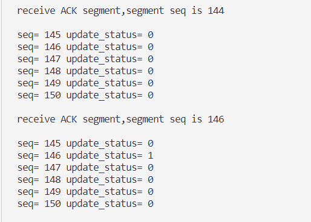

# lab 3.3 

2114036 曹骜天

本次实验在lab 3.1与lab3.2的基础上实现，将停等机制改为了基于滑动窗口的流量控制机制，**发送窗口和接收窗口的大小相等**，支持选择确认

## 协议设计
采用选择确认的方式，重传采用选择重传的方式(SR),即发送方每发送一个分组，就会启动一个定时器，等待接收方的确认，而接收方会对发送方发送的每一个报文序列都返回一个确认，如果发送方收到了确认，就会关闭定时器，若没有接收到，则启动超时重传机制，重传该分组，这样，然后接收方才能把窗口中完整的报文段进行文件保存，并向发送方返回一个确认，发送方将传输正确的连续报文从窗口中移除。示例图如下所示：


下面是实现选择重传交互的详细过程：

1. 发送方在发送前，先查看新发送的报文能否添加到窗口中，若不能则说明窗口已满，需要等待接收进程更新窗口，否则则将报文添加到窗口中并为其添加定时器，然后发送该报文，等待接收方的确认
2. 接收方收到报文后，首先会检查该报文的序列号是否是期望的连续的报文，若不是，则会在接收窗口空出期望收到的连续报文的位置，为后续发送方的超时重传做准备。**由于发送方的窗口大小与接收方的窗口大小相同，所以理论上不会出现接收窗口满了而发送方还有非重传的新报文段发送的情况**，于是可以顺利的将报文添加到接收窗口中。
3. 在接收到每一个报文后，接收方会根据这些报文是否连续且正确来决定要将窗口中的哪些报文保存到文件中。
4. 在这之后，接收方将发送一个ack报文段，该报文段的序列号与接收方接收到的序列号相同，发送方收到该序列号会关闭对应的计时器，再根据此时的窗口状态(接收到的连续序列号的ack报文段)来更新发送方的窗口。
5. 最后，发送方会检查窗口中还没有关闭的计时器是否有超时，若有则会重传对应的报文段。重传过后，接收方收到了重传的报文段补全了缺失部分，同第(3)步相同会保存正确的序列号、更新接收窗口、返回确认的ack报文段，发送方再可根据接收后的报文段来更新发送窗口。

## 滑动窗数据结构的设计
由于发送方与接收方的滑动窗所需要的功能不一样，设计采用的数据结构也有所区别，下面分别介绍。
### 发送方滑动窗功能的设计
发送方的滑动窗是在实验3.2的基础上进行改进的，主要成员如下：
```c++
class Window
{
private:
    //窗口大小
    int size;
    //滑动窗的缓冲区
    vector<char*> buffer;
    //缓冲区中每个报文的大小
    vector<int> msg_size;
    //缓冲区中每个报文的序列号
    vector<uint8_t> msg_seq;
    //下一个添加的报文在缓冲区中的位置
    int next;
    //可以更新的滑动窗的状态数组，只有从初始位置到该位置的报文都已经确认，才可以更新
    vector<bool> update_status;
    //为滑动窗中每一个报文设置一个计时器
    vector<Timer*> timer_list;
public:
    Window(): size(WINDOW_SIZE),next(0){};
    //添加报文到滑动窗缓冲区中
    int add_to_window(char* msg,int msg_size,uint8_t seq);
    //GBN协议使用：接收到ACK后，将已经确认的报文从滑动窗中删除
    int update_window(uint8_t ack);
    //判断某个ack是否在滑动窗中,存在返回对应的下标，不存在返回-1
    int is_in_window(uint8_t ack);
    //判断滑动窗是否为空
    bool is_empty(){return next==0;};
    //返回next
    int get_next(){return next;};
    //返回对应的buffer
    char* get_buffer(int index){return buffer[index];};
    //返回对应的msg_size
    int get_msg_size(int index){return msg_size[index];};
    //返回对应的msg_seq
    uint8_t get_msg_seq(int index){return msg_seq[index];};
    //返回计时器
    Timer* get_timer(int index){return timer_list[index];};
    //输出滑动窗的信息
    void print_window();
    //BR协议使用：接收到ACK后，将该ACK对应的报文从滑动窗中删除，前提是该ACK之前的报文都已经确认
    int update_window_br(uint8_t ack);
};
```
和lab3.2的滑动窗相比，多了两个私有成员变量：
- update_status:用于记录滑动窗中每一个报文的状态，当报文被添加到滑动窗中时，会将对应的位置设置为false，当收到对应的ack报文段时，会将对应的位置设置为true，当从**初始位置到该位置的报文都已经确认**时，就可以更新滑动窗到当前了。
- timer_list:用于为滑动窗中的每一个报文设置一个计时器，当报文添加到滑动窗中并发送后，会开启计时器；当收到对应的ack报文段时，会关闭对应的计时器，当计时器超时时，会重传对应的报文段。
  
在public数据内，以下成员变量做了改进：
- add_to_window:在添加报文到滑动窗中时，会将对应的位置的update_status设置为false，表示该报文还没有被确认，**同时会为该报文设置一个计时器**，当计时器超时时，会重传对应的报文段。
- get_timer:返回对应的计时器，用于在收到对应的ack报文段时关闭计时器，或者遍历滑动窗里的所有报文的计时器，在计时器超时时重传对应的报文段。
- update_window_br:在收到对应的ack报文段时，会将对应的位置的update_status设置为true，表示该报文已经被确认，然后会遍历滑动窗中的报文的update_status，若一直到某个报文段之前都已经被确认(被置为true)，则会将滑动窗更新到该位置，即将这些报文从滑动窗中删除，直到该位置的报文还没有被确认(为false)为止。具体函数的实现可以看压缩包的源代码。
### 接收方滑动窗功能的设计
接收方的滑动窗不需要计时器的重传操作，所以不需要为每一个报文设置一个计时器，但是还是需要记录每一个报文的状态，所以设计如下：
```c++
class Window
{
private:
    //窗口大小
    int size;
    //滑动窗的缓冲区
    vector<char*> buffer;
    //缓冲区中每个报文的大小
    vector<int> msg_size;
    //缓冲区中每个报文的序列号
    vector<uint8_t> msg_seq;
    //下一个添加的报文在缓冲区中的位置
    int next;
    //可以更新的滑动窗的状态数组，只有从初始位置到该位置的报文都已经确认，才可以更新
    vector<bool> update_status;
public:
    Window(): size(WINDOW_SIZE),next(0){};
    //添加报文到滑动窗缓冲区中
    int add_to_window(char* msg,int msg_size,uint8_t seq);
    //判断某个ack是否在滑动窗中,存在返回对应的下标，不存在返回-1
    int is_in_window(uint8_t ack);
    //判断滑动窗是否为空
    bool is_empty(){return next==0;};
    //返回next
    int get_next(){return next;};
    //返回对应的buffer
    char* get_buffer(int index){return buffer[index];};
    //返回对应的msg_size
    int get_msg_size(int index){return msg_size[index];};
    //返回对应的msg_seq
    uint8_t get_msg_seq(int index){return msg_seq[index];};
    //输出滑动窗的信息
    void print_window();
    //BR协议使用：接收到报文段后，将该ACK对应的报文从滑动窗中保存到文件里，前提是该报文之前的报文都已经被接收到
    int update_window_br();
};
```
和发送方相比，虽然函数名一样，但执行的操作不相同:
- add_to_window：同样是添加报文段到缓冲区中，但是有着如下的前提：**接收到的报文段的序列号必须是期望的连续的序列号**，若不是，则会在接收窗口中空出期望收到的连续报文的位置，简单来说就是将一个`buffer==nullptr`的报文段添加到接收窗口中，然后将该报文的`update_status`设为0，表示**缺失该报文**，最后再将接收到的报文添加到接收窗口中(若是重传报文则只需要修改窗口中预留位置的数据即可)，将该报文的`update_status`设为1(注意该报文可能为重传报文)，就这样，接收窗口中可以做到接收带有缺失的报文，同时也可以接收到正确的报文段并补全窗口。

## 关键代码分析

### 发送方
发送方分为发送线程和接收线程，其中**接收线程负责更新窗口和重传操作**，下面将分别介绍。

#### 发送方的发送线程
发送方的发送线程较为简单，分为两个步骤：
1. 首先调用Window的成员函数`add_to_window()`,查看是否能成功添加进滑动窗口，若添加成功，该函数会返回0，我们要做的就是一直等待，直到滑动窗中有空位可以接收新的数据报，对窗口的更新操作在发送方的接收线程中完成。
2. 调用`sendto()`函数将数据报发送出去。
```c++
int UDP_Sendmsg(SOCKET& clientSocket,SOCKADDR_IN& serverAddr,int& serverAddrLen,char* sendbuffer,size_t sendSize)
{
    ssize_t recvSize;
    //先看是否能够添加到窗口中,若不能说明窗口已慢，需要等待
    while(window->add_to_window(sendbuffer,sendSize,seqnum)!=0)
    {};

    //发送数据报文,其中sendbuffer已经封装好,包含了UDP报文头部
send_first_step:
    if(sendto(clientSocket,sendbuffer,sendSize,0,(sockaddr*)&serverAddr,serverAddrLen)<=0)
    {
        cerr<<"send data segment failed,now going to resend...:"<<WSAGetLastError()<<endl;
        goto send_first_step;
    }
    cout<<"send data segment success, segment seq = "<<int(seqnum)<<endl;
    //输出此时缓冲区的情况
    cout<<"now the window is:"<<endl;
    window->print_window();

    return 0;
}
```

#### 发送方的接收线程
发送方的接收线程相对来说比较复杂，主要工作是循环接收ack报文段，在接收到end报文段(表示传输文件的结束)后并且窗口为空时，结束传输：
1. 首先调用`recvfrom()`函数接收报文段，然后进行校验和的检查，若校验和不正确，则丢弃该报文段，重新接收。
2. 若校验和正确，再判断报文的类型，是否为`ACK`或者`END`，若不是则说明接收出错，退出接收线程并报错。
3. 若接收到的是`END`报文段，则说明文件传输已经到了最后的阶段，没有新的报文段需要发送，最多只有可能等待在窗口中需要重传的报文段，为了识别这个状态，定义了`has_recv_end`标志位并在此时置为1。
4. 根据接收到的报文段更新滑动窗口，调用客户端的`update_window_br`函数，进行滑动窗口的更新，该函数的功能在描述窗口数据结构时已经介绍过了。
5. 在更新完窗口后，在刚刚`has_recv_end==true`的条件下再判断窗口是否为空，若为空，则说明文件传输已经结束，退出接收线程。
6. 接下来是重传的实现，要做的就是遍历窗口中的所有计时器，若有计时器超时，则重传对应的报文段，并重新开启该计时器。
```c++
DWORD WINAPI recv_thread(LPVOID lpParameter)
{
    thread_param* param=(thread_param*)lpParameter;
    while(1)
    {
        //接受ACK报文/END报文
        if(recvfrom(param->clientSocket,param->recvbuffer,MAXBUFSIZE,0,(sockaddr*)&param->serverAddr,&param->serverAddrLen)!=SOCKET_ERROR)
        {
            UDP_HEADER header;
            memcpy(&header,param->recvbuffer,sizeof(header));
            //检验和，若不正确则丢弃，等待超时重传
            if(UDP_checksum((uint16_t*)param->recvbuffer,header.length)!=0)
            {
                cerr<<"recv ACK checksum error"<<endl;
                continue;
            }
            //判断是否为ACK报文
            if(header.flag!=ACK && header.flag!=END)
            {
                cerr<<"ACK/END flag error! program stop!!!"<<endl;
                return -1;
            }
            cout<<"receive ACK segment,segment seq is "<<(int)header.seq<<endl<<endl;
            if(header.flag==END)
                has_recv_end=true;
            //更新滑动窗
            window->update_window_br(header.seq);
            window->print_window();
            if(has_recv_end==true && window->is_empty())
            {
                cout<<"receive END segment and Window is empty, receive Thread stop..."<<endl<<endl;
                return 0;
            }
        }
        //遍历窗口中的所有计时器，若超时则重传
        for(int i=0;i<window->get_next();i++)
        {
            if(window->get_timer(i)->is_timeout())
            {
            //重传该计时器对应的报文
                if(sendto(param->clientSocket,window->get_buffer(i),window->get_msg_size(i),0,(sockaddr*)&param->serverAddr,param->serverAddrLen)<=0)
                {
                    cerr<<"retransmission data segment failed"<<endl;
                    continue;
                }
                cout<<"retransmission data segment success,segment seq is "<<(int)window->get_msg_seq(i)<<endl;
                //重新开始计时
                window->get_timer(i)->start_timer(window->get_msg_seq(i));
            
            }
        }
    }
}
```

### 接收方
接收方在收到消息后，会进行如下的操作：
1. 首先调用`recvfrom()`函数接收报文段，然后进行校验和的检查，若校验和不正确，则丢弃该报文段，重新接收。
2. 校验和正确则判断标志位是否为`ACK`或者`END`，在此基础之上进行处理。
3. 调用接收方window的`add_to_window()`函数，将接收到的报文段添加到接收窗口中(可以中间有缺失)，具体函数的实现过程在描述窗口数据结构时已经介绍过了。
4. 调用`update_window_br()`函数，将接收到的报文段添加到文件中，并更新接收窗口。
```c++
    while(1)
    {
        //收到信息
        if((recvSize=recvfrom(serverSocket,recvbuffer,MAXBUFSIZE,0,(sockaddr*)&clientAddr,&clientAddrLen))>0)
        {
            memcpy(&header,recvbuffer,sizeof(header));
            //校验和
            if(UDP_checksum((uint16_t*)recvbuffer,recvSize)!=0)
            {
                cerr<<"ACK checksum error, now is retransmission"<<endl;
                continue;
            }
            //接收到普通消息
            if(header.flag==ACK || header.flag==END)
            {
                //接收到消息看看能否加入到窗口中
                if(window->add_to_window(recvbuffer+sizeof(header),recvSize-sizeof(header),header.seq)==-1)
                {
                    cerr<<"receive window is full,add to window failed"<<endl;
                    continue;
                }
                else
                    cout<<"recieve msg success, msg seqnum= "<<int(header.seq)<<endl<<"msgsize= "<<recvSize<<endl;
                //TODO:对窗口中的报文段进行更新操作
                window->print_window();
                window->update_window_br();
                cout<<"update window success"<<endl;
                //发送ACK/END报文给客户端,发送相同的序列号
                init_header(header,SERVER_PORT,CLIENT_PORT,sizeof(header),0,header.seq,header.flag);
                memcpy(sendbuffer,&header,sizeof(header));
                if(sendto(serverSocket,sendbuffer,sizeof(header),0,(sockaddr*)&clientAddr,clientAddrLen)<=0)
                {
                    cerr<<"send ACK segment failed,now going to resend...:"<<WSAGetLastError()<<endl;
                    continue;
                }
                cout<<"send ACK segment success, seqnum= "<<int(header.seq)<<endl<<endl;
                memset(msg,0,MAXBUFSIZE-sizeof(header));
            }
        //接下来是四次挥手的过程，这里省略...
```

## 实验结果验证

设置相关参数如下：
- 窗口大小：10
- 丢包率：5%
- 延迟：5ms
- 数据报最大长度：4096bytes

传输文件结果如下：
- 1.jpg:
  
  

  可以看到，传输用时15218ms，传输吞吐率为976.398kbps,传输的总大小为1857353bytes，与源文件大小一致。
- 2.jpg:
  
  

  可以看到，传输用时49915ms，传输吞吐率为945.368kbps,传输的总大小为5898505bytes，与源文件大小一致。
- 3.jpg:
  
  

  可以看到，传输用时100657ms，传输吞吐率为951.27kbps,传输的总大小为11968994bytes，与源文件大小一致。
- helloworld.txt:
  
  

  可以看到，传输用时14725ms，传输吞吐率为899.59kbps,传输的总大小为1655808bytes，与源文件大小一致。

## 超时重传结果分析
查看如下的超时重传过程：



这是发送端的接收进程的日志输出：收到了144和146两个确认序号，没有收到145，于是145的`update_status==false`保持不变。


但由于此时窗口未满，还是可以继续发送报文，且这些报文也收到了对应的确认序列号，`update_status`被置为true。直到145对应的计时器超时，开始重传145，重传成功后，接收端返回145的ack报文，发送端窗口145的`update_status`被置为true，可以更新窗口了(之前不能更新是因为145的`update_status`为false，且145占据的窗口的起始位置)。

在这个过程中，接收端的窗口变化如下：


由于145的`update_status`一直为false，所以在145之后的报文都只能暂存在接收段的窗口中，直到接收到145的重传报文，将145的`update_status`置为true，才能更新窗口。对文件进行write操作，在这里显示由于从窗口开始到最后的`update_status`都是true，所以向文件中写入了从窗口开始到最后的报文段，这样就保证了文件的正确性。

**notice**：这里没有写入最后一个报文段，因为这是在传输过程的最后，报文段150没有携带任何数据，只是一个`end`报文段，并不是程序出错，特此说明。